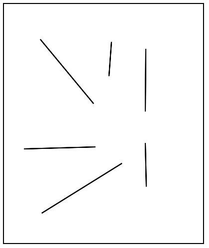
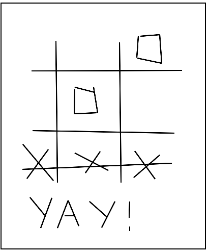

#Drawing Lines
Now that we know how to use mouse events with clicking and moving a mouse, we're going to create a program to draw some lines. 

##The end goal
When the user clicks and drags the mouse within the canvas, the cursor will draw some lines. It's easiest to break this problem down into parts. 



##Mouse events
We will need to make use of some mouse events. Specifically, we want to respond when the user presses the mouse down and when the user drags the mouse. We can have two functions, one for each of those actions: 

```
function start() {
    mouseDownMethod(down);
    mouseDragMethod(drag);
}
```
##Global variables
To have some variable that lives between functions, we'll need one global variable, such as one for the line. It should exist between functions for clicking the mouse and dragging it. Notice that we use the keyword, "var," in front of our variable name to declare it.

```
var line;

function start() {
    mouseDownMethod(down);
    mouseDragMethod(drag);
}
```

##Clicking the mouse

Every time the mouse goes down, we will create a line. The endpoints of the line will be right where the click action is, and every time we drag the mouse, then just change the endpoints. We will want to create another function for the start and endpoints of the line, passing in the mouse event, e. Then, we'll add the line to the canvas. 

Notice that we do not put the keyword, "var," before ```line```. If we did, ```line``` would become a local variable and we would get an error when running our program. It is crucial for us to point to the global variable that is set in another function.

Just with the following code, nothing will seem to happen when the program is run. 

```
var line;

function down(e) {
    line = new Line(e.getX(), e.getY(),
                    e.getX(), e.getY());
    add(line);
}

function start() {
    mouseDownMethod(down);
    mouseDragMethod(drag);
}
```

##Dragging the mouse
Now, let's change the endpoint so that the new endpoints of the line are set when we drag the mouse. 

```
var line;

function drag(e) {
    line.setEndpoint(e.getX(), e.getY());
}

function down(e) {
    line = new Line(e.getX(), e.getY(),
                    e.getX(), e.getY());
    add(line);
}

function start() {
    mouseDownMethod(down);
    mouseDragMethod(drag);
}
```
Excellent! Now it looks like our program works.

##Final result

Here is the finished program:
```
var line;

function down(e) {
    line = new Line(e.getX(), e.getY(),
                    e.getX(), e.getY());
    add(line);
}

function drag(e) {
    line.setEndpoint(e.getX(), e.getY());
}

function start() {
    mouseDownMethod(down);
    mouseDragMethod(drag);
}
```

