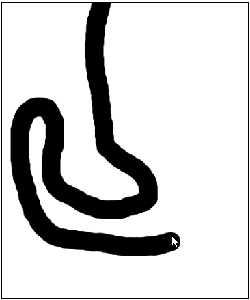
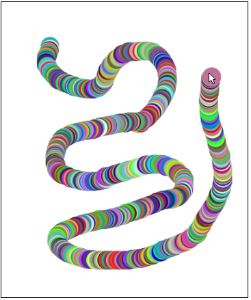
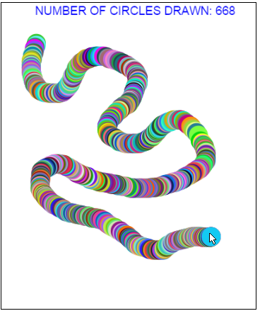

# Mouse Move Events

In the previous chapter, you learned how to respond to a mouse click. But what if you want to respond to a user moving a mouse? What if the user holds the mouse button down? What if they drag the mouse? How would we handle these things? Surely, there must be a way!

### More Mouse Methods

The `mouseClickMethod` is just one of many different methods available for handling mouse input. More are listed below:

| Mouse Method | Responds To|
| -- | -- |
| mouseClickMethod(callbackFunction); | Mouse click |
| mouseMoveMethod(callbackFunction); | Mouse movement |
| mouseDownMethod(callbackFunction); | Mouse pressed down |
| mouseUpMethod(callbackFunction); | Mouse released|
| mouseDragMethod(callbackFunction);| Mouse dragged |

## Using Mouse Methods

If you recall, we respond to a mouse click by doing the following:


```
function start(){
    // This tells the program that when a mouse
    // click happens, the function named
    // 'callbackFunction' should be called
    mouseClickMethod(callbackFunction);
}

// This is the callback function
function callbackFunction(e){
    //Code here to do something when the mouse is clicked.
}
```

Other mouse methods take on the same basic structure. For example, we would respond to a mouse being moved by doing:

```
function start(){
    // This tells the program that when a mouse
    // movement happens, the function named
    // 'callbackFunction' should be called
    mouseMoveMethod(callbackFunction);
}

// This is the callback function
function callbackFunction(e){
    //Code here to do something when the mouse is moved.
}
```

## Painting with the Mouse

Let's create a simple painting program using the mouse move method. This program will paint circles along a path that the mouse is moved:

```
function start(){
	mouseMoveMethod(paint);
}

function paint(e){
	var circle = new Circle(15);
	circle.setPosition(e.getX(), e.getY());
	add(circle);
}
```

The `mouseMoveMethod` in the `start()` function automatically detects when the mouse is moved. Each time it detects mouse movement, the `paint(e)` function gets called. 

Within our `paint(e)` function, we create a circle of radius 15. We then set the circle's position. Recall that `e.getX()` and `e.getY()` return the X and Y positions of the mouse's location. Thus, we are setting the circle's position to the mouse's current location. Finally, we add the circle to the screen.

Remember, the `paint(e)` function is called **every time** the mouse moves to a new location. This results in a snake-like trail of circles along the mouse's path:



### Improving Our Painting Program

While our painting program is nice, it could use a little bit more polish. Instead of drawing circles when the mouse is moved, let's draw circles when the mouse is dragged. Dragging differs from simple mouse movement in that the user must hold down the mouse button while moving. Additionally, this program will randomly generate a color for each circle drawn.

```
function start(){
	mouseDragMethod(paint);
}

function paint(e){
	var circle = new Circle(15);
	circle.setColor(Randomizer.nextColor());
	circle.setPosition(e.getX(), e.getY());
	add(circle);
}
```

This results in a beautiful trail of color:




### Counting the Circles

You may have noticed that our painting program draws **a lot** of circles in a short amount of time. For curiosity's sake, let's add a text label which counts the total number of circles drawn to the screen.

```
var CIRCLE_RADIUS = 15;
var txt;
var numCircles = 0;

function start(){
    initializeCirclesCounter();
	mouseDragMethod(paint);
}

function paint(e){
	var circle = new Circle(CIRCLE_RADIUS);
	circle.setColor(Randomizer.nextColor());
	circle.setPosition(e.getX(), e.getY());
	add(circle);
	
	updateCounter();
}

function initializeCirclesCounter(){
    txt = new Text("NUMBER OF CIRCLES DRAWN: 0", "14pt Arial");
    txt.setPosition(getWidth()/2 - txt.getWidth()/2, txt.getHeight());
    txt.setColor(Color.blue);
    add(txt);
}

function updateCounter(){
    txt.setText("NUMBER OF CIRCLES DRAWN: " + ++numCircles);
}
```

Each time a circle is drawn in our `paint(e)` method, we increment `numCircles` by 1 and display the change to the screen. The resulting program looks like:



## Strobe Ball

In this next program, we create a ball of random color and place it initially in the upper left corner of the screen. When the user moves the mouse, the ball will follow it and change to a different random color. This creates a strobe effect on our ball as it is moved around.

```
var BALL_RADIUS = 30;
var ball;

function start() {
    //Create the ball in the upper right corner
    ball = new Circle(BALL_RADIUS);
	ball.setPosition(ball.getHeight()/2, ball.getWidth()/2);
	ball.setColor(Randomizer.nextColor());
	add(ball);
	
	//On Mouse Move: Follow Mouse and Change Color
    mouseMoveMethod(moveBallAndStrobe);
}

function moveBallAndStrobe(e){
    ball.setColor(Randomizer.nextColor());
    ball.setPosition(e.getX(), e.getY());
}
```


