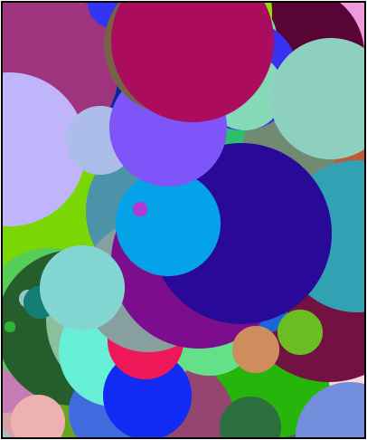

## Using Timers

Timers are a key part of creating animations. As such, they are often used to create fun and interesting graphical programs. Let's take a look at one such program, called "Random Circles."

```
/**
 * The Random Circles Program
 */

var MAX_RADIUS = 100;
var MAX_CIRCLES = 1000;
var counter = 0;

function start(){
	setTimer(draw, 50);
}

function draw(){
	drawCircle(Randomizer.nextInt(0, MAX_RADIUS),
			   Randomizer.nextColor(),
			   Randomizer.nextInt(0, getWidth()),
			   Randomizer.nextInt(0, getHeight()));
	
	counter++;
	
	if(counter == MAX_CIRCLES){
		stopTimer(draw);
	}
}

function drawCircle(radius, color, x, y){
	var circle = new Circle(radius);
	circle.setColor(color);
	circle.setPosition(x, y);
	add(circle);
}
```



Let's start by examining the timer. The timer is created at the very beginning of the program in the `start` function.

---

What function is the timer calling?

- ( ) `makeBall`
- (x) `draw`
- ( ) `drawCircle`
- ( ) `start`
- ( ) `timer`

> There is no `makeBall` function in the code.
> Correct!
> The `drawCircle` function is called by the `draw` function, not the timer.
> The `start` function is not called by the timer.
> The timer cannot call itself.

How often does the timer call this function?

- ( ) Every minute
- ( ) Every 50 seconds
- ( ) Every 5 milliseconds
- ( ) Every 5 seconds
- (X) Every 50 milliseconds 

> Incorrect.
> The delay is given in milliseconds, not seconds.
> Note that it is 50 and not 5.
> 
> Correct!

---

## Stopping a Timer

Timers will continue to run until they are given the command to stop. A timer can be stopped by issuing the `stopTimer(functionName)` command. The `functionName` should be the name of the function that was originally passed to the timer when creating it with `startTimer()`.

For example, Karel could create a timer that called a `giveTreat` function every 1000 milliseconds:

```
startTimer(giveTreat, 1000);
```

Karel could then stop the timer by issuing the following command:

```
stopTimer(giveTreat);
```

---

In the Random Circles program above, what command will stop the timer from drawing new circles?

- ( ) `stopTime(draw)`
- ( ) `stop(draw)`
- (X) `stopTimer(draw)`
- ( ) `stopTimer(draw, 50)`
- ( ) `stopTimer(drawCircle)`

> Close, but the command is `stopTimer`, not `stopTime`.
> The proper command is `stopTimer`.
> Correct!
> You should only pass the name of the function being called, not a delay.
> You'll need to give the proper function name that the timer is calling.


When does the timer stop in the Random Circles program?

- (X) When the `counter` reaches 1000.
- ( ) When the screen is filled with circles.
- ( ) It does not stop until there are 990 circles.
- ( ) The timer stops when there are no more circles.
- ( ) We can't stop, we won't stop.

> Correct!
> Notice the `counter` variable is checked each time `draw` is called.
> The value of `MAX_CIRCLES` is 1000, not 990.
> There is not a built in number of circles that can be drawn.
> We run things, things don't run we.

---

## Using Multiple Functions with a Timer

Programs often need to call multiple functions every tick of the timer. However, the call to `startTimer` can only take one single function. This code would not work for Karel:

```
startTimer(giveTreat, giveToy, takeKarelForWalk, 1000);
```

Instead of passing multiple functions when calling `startTimer`, Karel will need to create one function that then makes calls to the other functions:

```
startTimer(makeKarelHappy, 1000);

...

function makeKarelHappy(){
    giveTreat();
    giveToy();
    takeKarelForWalk();
}

```

With this code, the `makeKarelHappy` function will be called every 1000 milliseconds. That function then calls each of Karel's other functions. Notice that in the Random Circles program, the timer calls the `draw` function, which then calls `drawCircle`.
