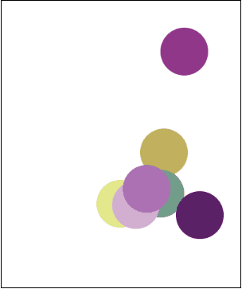

# Iterating Over an Array

Suppose you are given an array representing a student's test grades for the year:

```
var examGrades = [98, 82, 88, 91, 77, 84, 92, 88, 100, 67, 79];
```

To print out the grades, you will recall that we write a for loop which iterates through each of the array's indices:

```
for (var i = 0; i < examGrades.length; i++) {
    println("Exam " + i + ": " + examGrades[i]);
} 
```

The resulting output looks like:

```
Exam0: 98
Exam1: 82
Exam2: 88
Exam3: 91
Exam4: 77
Exam5: 84
Exam6: 92
Exam7: 88
Exam8: 100
Exam9: 67
Exam10: 79
```

You can accomplish a lot by iterating over arrays. You are not limited to simply printing out the contents!

## More Things to do Using Iteration!

What else can you do with a list of grades? To start, you might be interested to know what the student's **average** exam grade is. With iteration, calculating the average is easy!

```
function start(){
	var examGrades = [98, 82, 88, 91, 77, 84, 92, 88, 100, 67, 79];
    var examAverage = calculateAverage(examGrades);
    println("Overall average exam grade: " + examAverage);
}

function calculateAverage(arr) {
    // Declare and initialize variables
    var total = 0;
    var average = 0;
    var arrayLength = arr.length;
    // Sum all the grades
    for (var i = 0; i < arrayLength; i++) {
        total += arr[i];
    }
    // Calculate the average
    average = total / arrayLength;
    return average;
}
```

In our `calculateAverage` function, we start by declaring our variables. We set the initial values of `total` and `average` to 0. The `arrayLength` variable represents the total number of grades in the array. In this particular example, the `examGrades` array has 11 total grades, so `arrayLength` is equal to 11.

After setting up our variables, we loop through the array and add all of the grades together. The resulting sum is stored into `total`. To compute the `average`, we just divide the `total` by the number of grades in the array, `arrayLength`. The program will print:

```
Overall average exam grade: 86
```


## Flipping Coins

In this program, we use an array to store a large amount of coin flips.

```
var NUM_FLIPS = 100;

/* Write a program to flip a coin NUM_FLIPS
 * times an put the results into an array.
 * We also want to print that array.
 */
function start(){
	var flips = flipCoins();
	printArray(flips);
}

// This function should flip a coin NUM_FLIPS
// times, and add the result to an array. We
// return the result to the caller.
function flipCoins(){
	var flips = [];
	for(var i = 0; i < NUM_FLIPS; i++){
		if(Randomizer.nextBoolean()){
			flips.push("Heads");
		}else{
			flips.push("Tails");
		}
	}
	return flips;
}

function printArray(arr){
	for(var i = 0; i < arr.length; i++){
		println(i + ": " + arr[i]);
	}
}
```

In the `start()` function, we first call our `flipCoins()` function. The `flipsCoins()` function populates a new array with coin flips. The resulting array returned by `flipCoins()` is then printed to the screen.

In the `flipsCoins()` function, we start by initializing a new array called `flips`. We then create a for loop which loops from 0 up until `NUM_FLIPS`. In this particular example, we set the number of flips to 100. For each iteration in the for loop, we randomly push a value of either `"Heads"` or `"Tails"` into the `flips` array. `Randomizer.nextBoolean()` has a 50% chance of returning either true or false. Thus, we have a 50% chance of either pushing `"Heads"` or `"Tails"` into the array. We finish the function off by returning the array of coin flips.

Here is an example of what might get printed. To save space, we have omitted the coin flips from indices 8 - 92.

```
0: Heads
1: Heads
2: Heads
3: Heads
4: Heads
5: Heads
6: Tails
7: Heads
.
.
.
93: Heads
94: Heads
95: Heads
96: Heads
97: Heads
98: Tails
99: Heads
```

This is just one example of many. Since each of the coin flips have a 50% chance of either being `"Heads"` or `"Tails"`, these values will change each time you run the program.

## Lots of Crazy Balls

In this program, we create an array of circles. We use array iteration to make the circles flash and dance around the screen.

```
var RADIUS = 40;
var NUM_CIRCLES = 7;
var DELAY = 100;

var circles = [];

function start(){
	createCircles();
	setTimer(goCrazy, DELAY);
}

function createCircles(){
	for(var i = 0; i < NUM_CIRCLES; i++){
		var circle = new Circle(RADIUS);
		updateCircle(circle);
		add(circle);
		circles.push(circle);
	}
}

function goCrazy(){
	for(var i = 0; i < circles.length; i++){
		updateCircle(circles[i]);
	}
}

function updateCircle(circle){
	var x = Randomizer.nextInt(
		RADIUS, getWidth() - RADIUS);
	var y = Randomizer.nextInt(
		RADIUS, getHeight() - RADIUS);
	circle.setPosition(x, y);
	circle.setColor(Randomizer.nextColor());
}

```

Like all good programs, we start by declaring some useful constants at the top. We use `RADIUS` to represent the circle's radius, `NUM_CIRCLES` to represent the number of circles, and `DELAY` to represent the animation delay. We also need to make use of a global `circles` array, so we can access it across multiple functions.

In the `start()` function, we call a `createCircles()` function which populates the `circles` array with circles. We then use a timer to call the `goCrazy()` function every `DELAY` milliseconds. The `goCrazy()` function randomly moves each of the circles in the array and makes them change color.

The result looks like:

