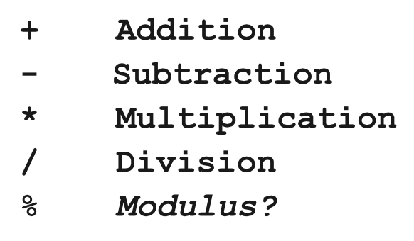
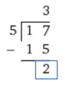

#Basic math in Javascript
Now that we are able to use variables and user input, we can really start coding the fun stuff!

###We can do basic math!
In our first program, we are going to create a simple calculator. This will allow us to add 2 numbers and print out the sum. 

We will read an integer from the user and store it in our first variable, then read another integer from the user and store it in the second variable. Lastly, we will add the two variables together. Let's see what this looks like: 
```
// Let's write a program that adds two numbers
function start(){
	var first = readInt("First: ");
	var second = readInt("Second: ");
	var sum = first + second;
	println(sum);
}
```
The output looks like:
```
First: 5
Second: 3
8
```
###Arithmetic operators in Javascript
There are five arithmetic operators that we can use with Javascript, most that you have likely used before. 



Here are some basic examples:
```
var x = 4; 
var y = 8;
println(x + y); //12
println(y - x); //4
println(x * y); //32
println(y / x); //2
```
The basic rules of arithmetic apply here. 

###What the heck is a modulus?
Remember when you learned long division and you would divide two numbers and have an integer as a remainder? Modulus means divide and take the remainder. 

What is 17 % 5? 

If we say, "What is 17 divided by 5?" The answer is 3 with 2 left over. Check out the long form of division:



The answer to 17 % 5 is 2.

###Increment and Decrement
It is very common in programming to want to add one (increment) or subtract one (decrement) a variable. An example for this is if we want to subtract one (decrement) from a store's inventory whenever an item has been purchased. 

Previously, if we wanted to add one to the current value of a variable, ```counter```, it would look like: 
```
//Add one to the counter
counter = counter + 1;
```
A faster way to do the same logic is to add ```++``` to a variable, like: 
```
//Shortcut, add one
counter++;
```
This will add one to ```counter``` just like the previous code. 

Similarly, if we want to subtract one, we can add ```--``` like: 
```
//Shortcut, subtract one
counter++;
```
There are also other shortcuts available if you want to modify the current value by using arithmetic operations. 

```
x += y; //is equal to x = x + y;
x-= y; //is equal to x = x - y;
x*= y; //is equal to x = x * y;
x /= y; //is equal to x = x / y;

```

###Example: Dollars to Pounds
Let's say that we want to write a program that will convert US dollars to British pounds. We will prompt the user for the amount of dollars. Then, we will multiply the conversion rate of dollars to pounds by the amount of dollars that the user specified. Lastly, we will print that value off.
