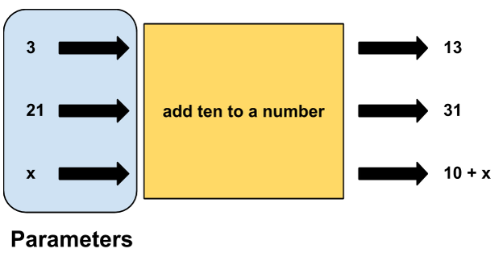
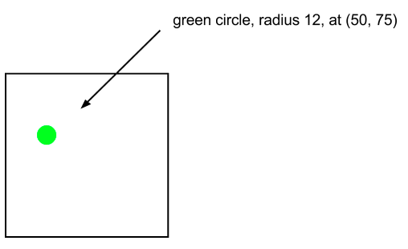

# Functions and Parameters

Writing functions allows us to break our code into well-organized and reusable parts. But sometimes we may want to reuse a function
with a slight change.

## Repetitive Actions
Take a look at the following code:

```
var x = 3;
var addTenToX = 10 + x;
println(addTenToX);

var y = 21;
var addTenToY = 10 + y;
println(addTenToY);
```

Notice that the code contains some repetition. The process of adding 10 to a variable is the same whether we're
adding `10 + 3` or `10 + 21`. In each case, we're adding 10.

## Parameters
Recall that functions are like blocks of code that do a particular thing. We can write a function that prints out
"hello" when called, or a function that draws a circle. But what if we want to create a function to add ten
to a number? We can sketch out the function like so:


We would expect an `addTen` function to add 10 to any number it is given. If we give it 3, the function will give us 13.
Were we to give it 32, it would give us 42. This pattern can be generalized even more: if we give the function
any number `x`, it will give us `x + 10` in return. The action that the `addTen` function takes is the same every time
-- it adds 10 -- the only thing that changes is the number we give to the function. The number that we pass
to the function is called a **parameter**.



## Defining a Function with Parameters
Let's write the `addTen` function in code:

```
function addTen(x){
    var xPlusTen = x + 10;
    println(xPlusTen);
}
```
Notice that there is an `x` that is being taken in and used by the function. This is the parameter. Its value will 
be whatever the user decides to "pass" to the function. Also note that the `x` parameter can be used like a
regular variable in the body of the function.

## Calling a Function with Parameters
Now that the `addTen` function is defined, it's time to call the function. Let's first add ten to the number 5:

```
addTen(5);
```
This will result in `15` being printed to the console.

This works with variables as well. We can create a variable `y` that stores a number, then pass `y` to the 
`addTen` function:

```
var y = 115;
addTen(y);
```

This will print `125` to the console.

## Multiple Parameters
It's often helpful to write functions that can take in more than one parameter. For example, if we were to write
a generic `add` function, we would want to be able to input two numbers. To include more than one parameter, you
can simply write more than one parameter, separated by a comma. The code below takes in two numbers, represented
by `x` and `y`, and adds them:

```
function add(x, y){
    var sum = x + y;
    println(sum);
}
```
We call the function in a similar manner. If we give the function the following calls:
```
add(10, 90);
add(635, 1000);
var first = 72;
var second = 14;
add(first, second);
```
then the program will print the following to the console:
```
100
1635
86
```

## Why Use Parameters?
Using parameters allows us to write code that is flexible and reusable. Writing a function is like telling the
program to do something (add two numbers or draw a rectangle on the canvas). Parameters are like giving that
function specific instructions ("I want to add 3 and 7" or "I want my rectangle to be red").

Functions can also take in multiple parameters. If you wanted to draw several circles, you'd likely want them
to be different sizes, colors, and in different places. If each of these pieces of information was hard-coded into 
the function, you would need a separate function for each circle!

Using parameters allows you to write one `drawCircle` function that can be used to draw many different
circles:

```
function drawCircle(color, radius, xPos, yPos){
    var circ = new Circle(radius);
    circ.setPosition(xPos, yPos);
    circ.setColor(color);
    add(circ);
}
```
To draw a green circle of radius 12 at position 50, 75:

```
drawCircle(Color.green, 12, 50, 75);
```



## An Important Note!
It's very important to pass parameters to functions in the proper order. Using the `drawCircle` example above, you
may know that `Color.green` is the name of the color and that you want the radius to be `12`, but the computer
does not know. The way that the computer finds out which parameter is which is by the order in which your code
passes the parameters into the function. For example, if you wrote:

```
drawCircle(Color.green, 50, 12, 75);
```

you would end up with a green circle of radius 50 at position `(75, 12)`. That's quite different from the circle
above, even though it is using the same numbers!


In conclusion, order matters when you are using parameters.

