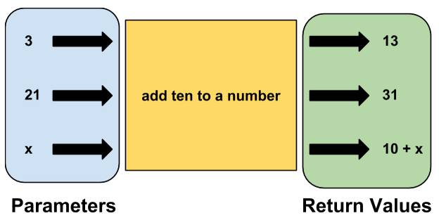

# Functions and Return Values

Similar to how functions can take in values as parameters, functions can also return values.

## Keeping Results

Recall the `addTen` function from the previous chapter:

```
function addTen(x){
    var xPlusTen = x + 10;
    println(xPlusTen);
}
```



This function takes in a parameter, `x`, and adds 10 to it. Lastly, the program prints the value to the console.

But what if we wanted to store the value of `x` plus 10? In the function above, `x + 10` is stored into a local
variable called `xPlusTen`. However, this variable is lost when the function is finished -- it cannot be accessed
outside of the function.

Using a **return statement** will allow us to pass a value back out of the function. That return value can be stored
into a variable for later use.

Here's how to rewrite `addTen` to return a value instead of printing:

```
function addTen(x){
    var xPlusTen = x + 10;
    return xPlusTen;
}
```

Note that the `return` keyword does not require parentheses. Also, returning a value does not print that value to the console, similar to how passing in a value as a
parameter does not print the value to the console.

## Calling a Function With a Return Value

A return value by itself would not be very useful, given that it does not print to the console. Fortunately, we
can store a function's return value into a variable. Take a look at the following code:

```
var num = 7;
var tenAdded = addTen(7);
```

First, we create a variable named `num` and initialize it to 7. Then, we create another variable called `tenAdded`.
Notice that `tenAdded` is not given a normal value. Instead, we are setting it equal to `addTen(7)`. This means
that the `tenAdded` variable will hold the result of whatever the function call `addTen(7)` returns. We know that
`addTen(7)` will return 17, so `tenAdded` will be `17`.


## Multiple Parameters With a Return Value
Return values work in many situations. For example, we can rewrite the `add` function from the previous section
to return the sum instead of print it to the screen:

```
function add(x, y){
    var sum = x + y;
    return sum;
}
```
We can now call the function and store its return values 
```
var sum = add(10, 90);
println(sum);
```
which would print `100` to the console.


