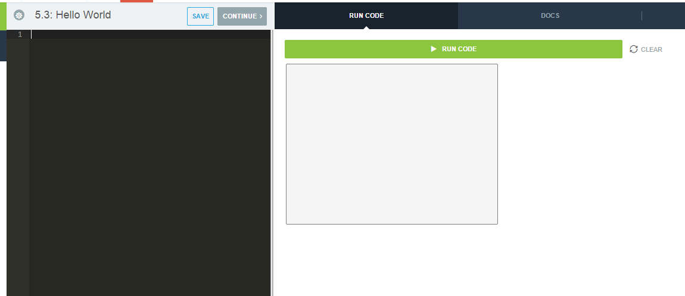

# JavaScript Hello World
In this section, we're going to learn how to set up and run our first program in JavaScript - Hello World!

### Environment Set Up
Using CodeHS's editor, writing JavaScript is straightforward. In the picture below, the black box is where you write your code. Yours may be white.  When you want to try out your code, click the green "Run Code" button.  Any output your program creates will appear in the white box on the right. To clear any output, click the "Clear" button. 



Now that we know how to use the editor, let's write the first program.

### Hello World
The first thing we always need when writing JavaScript is a function called ```start()```.  It looks like this:

```
function start(){

}
```

We'll go over what functions are later. For now, know that any code you put between the curly braces of the start function will run when you click "Run Code".  

Now let's write our first command.  It's called ```println()```.  It prints out whatever you put inside of the parenthesis to the output box.

```
function start(){
    println("Hello World");
}
```

When you run this, Hello World will appear in the output box.

There are a couple of important things to note.  First, notice we put Hello World inside quotes and put that inside of the parenthesis.  Notice that the command ends with a semicolon.  Both of these things are absolutely required in order for your program to work.

### Keywords
In JavaScript, there are certain words that are already given a special meaning by JavaScript.  These words are special and can only be used in one way.  The word ```function``` is an example of a keyword.  As we continue through the chapter, more keywords will be introduced.

### Extensions to Your Program
Great!  You have written your first JavaScript program! Now let's play around with it a little bit.  Try putting something else inside of the parenthesis.  For example, try putting

```
println("I am learning JavaScript!");
```

What happens?  Try putting more than one ```println()``` statement. For example, 

```
println("My name is Alice.");
println("I am learning JavaScript");
```

What happens then?