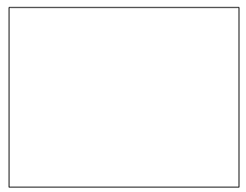
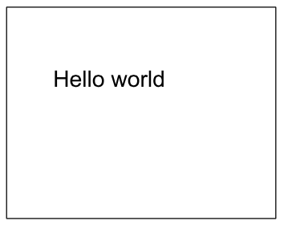
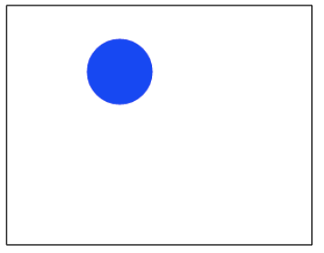
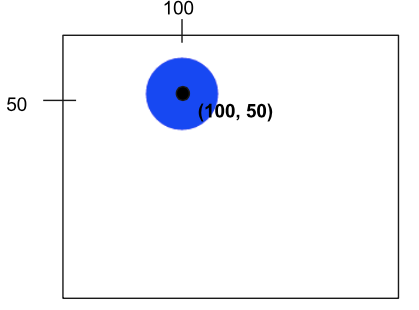
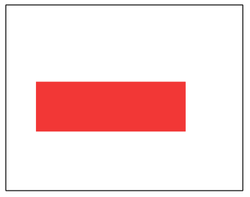
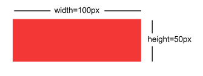
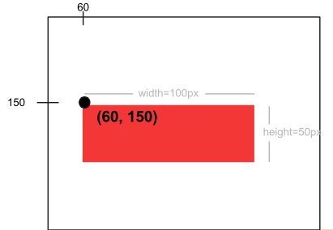

#Using Graphics in Javascript
Add some color and creativity to your code by using graphics in Javascript!

###The artist's canvas
Just like painters creating a masterpiece, we will be using a canvas when creating graphics. The canvas will start off blank and looks like this: 



###The coordinate system    
The first thing we need to start off with the canvas is to know how the coordinate system works. It's a little different than your normal coordinate system in that the x and y axis start in the top left at (0,0). The x axis continues straight to the right all the way to the top right corner. The y axis continues from the top left corner down vertically to the bottom left corner in the positive y direction. Here is an example: 


The dot is 200 pixels to the right in the positive x direction, and is at 0 pixels down in the y direction. 

There are a few important properties of the canvas that we might like to get, such as the width and height of the canvas. We can use ```getWidth()``` and ```getHeight()``` to retrieve those values.


###Graphics "Hello World"
Our first program will create some text and throw it into the canvas as text. It should look like:



We want to first create new Text that says "Hello World." Then, we will want to set its position to be at a specific location or using properties of the canvas. Lastly, we will want to add this text to the canvas (and to the screen). 

The code looks like: 

```
function start() {
    var text = new Text("Hello World");
    text.setPosition(100, 100);
    add(text);
}
```

###Let's make a circle!
Next, let's make a circle appear on the canvas! Here's what it will look like:



We want to create a blue circle with the radius of 30 at location (100, 50). First, we will create a circle and give it a radius of 30. Then, we will set the position of the circle at (100, 50). After that, we will want to set the color of the circle to be blue. Lastly, we will add the circle to the canvas for it to appear on the screen. 

The code will look like:
```
function start() {
    var circle = new Circle(30);
    circle.setPosition(100, 50);
    circle.setColor(Color.blue);
    add(circle);
}
```
We create the circle with a radius of 30, then give that circle some directions to be set in a certain location and given a certain color, then the canvas adds that circle. Note that the position of a circle is taken from the middle of the circle in the canvas. 



###Introducing Rectangles
Let's make a rectangle on the canvas. It will look like: 



We will first create a rectangle and give it a height and width. Then, we will set its position to be (60, 150). After that, we'll set the color to be red. Lastly, we'll add the rectangle to the canvas. 

```
function start() {
    var rect = new Rectangle(100, 50);
    rect.setPosition(60, 150);
    rect.setColor(Color.red);
    add(rect);
```
Let's break this code down further. When creating a rectangle, we need to specify the height and width in pixels, like this:
```
var rect = new Rectangle(100, 50);
```


Then, we will set the location of the rectangle to be 60 pixels to the right, 150 pixels down. 



Lastly, we'll finish by setting its color to red and adding it to the canvas. 

###Example: 8 Ball
Here's one more complex example: We will draw an 8 ball on the canvas. We first will create a new ball with a radius of 100. Then, we will find the middle of the canvas by using ```getWidth()``` and ```getHeight()``` and dividing those properties by 2. After, we will set the ball's position to be in the middle of the canvas and add it to the canvas. For the text, we will create new text, set its font and color, then subtract half of the text's width from the center width of the canvas and add half of the text's width to the center height of the canvas. 
```
// This program will draw an 8 ball 
// centered on the screen. The circle
// should be black with radius 100, and
// the "8" should be white in 50pt Arial
// font.
function start(){
	var ball = new Circle(100);
	var centerX = getWidth() / 2;
	var centerY = getHeight() / 2;
	ball.setPosition(centerX, centerY);
	add(ball);
	
	var number = new Text("8");
	number.setFont("50pt Arial");
	number.setColor(Color.white);
	number.setPosition(centerX - number.getWidth()/2, centerY + number.getWidth()/2);
	add(number);
}
```
###Reference
####Circle
How to make a circle:
```
var circle = new Circle(radius);
```
Set position (of center of circle):
```
circle.setPosition(xPos, yPos);
```
Add to screen:
```
add(circle);
```
####Rectangles
How to make rectangle:
```
var rect = new Rectangle(width, height);
```
Set position (of top left corner):
```
rect.setPosition(xPos, yPos);
```
Add to screen:
```
add(rect);
```
####Text
How to make text:
```
var text = new Text(label);
```
Set position (of bottom left corner):
```
text.setPosition(xPos, yPos);
```
Add to screen:
```
add(text);
```

