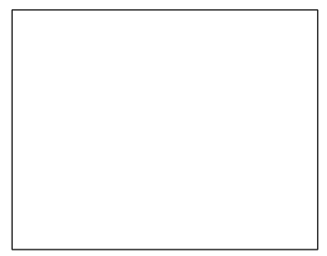
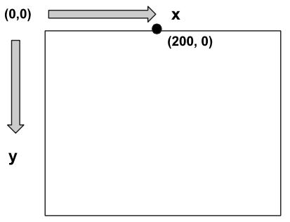
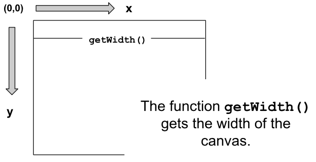
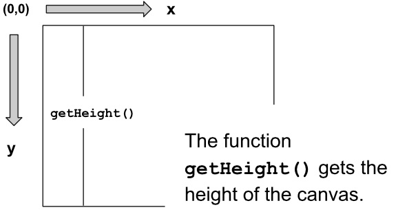

#Using Graphics in Javascript
Add some color and creativity to your code by using graphics in Javascript!

###The artist's canvas
Just like painters creating a masterpiece, we will be using a canvas when creating graphics. The canvas will start off blank and looks like this: 


###The coordinate system    
The first thing we need to start off with the canvas is to know how the coordinate system works. It's a little different than your normal coordinate system in that the x and y axis start in the top left at (0,0). The x axis continues straight to the right all the way to the top right corner. The y axis continues from the top left corner down vertically to the bottom left corner in the positive y direction. Here is an example: 



The dot is 200 pixels to the right in the positive x direction, and is at 0 pixels down in the y direction. 

There are a few important properties of the canvas that we might like to get, such as the width and height of the canvas. We can use ```getWidth()``` and ```getHeight()``` to retrieve those values.




