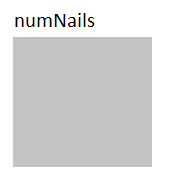
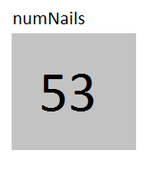
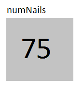

# Variables
Now that we've written our first program, let's look how we can further expand our programs by using variables.

### What Are Variables?
Variables in JavaScript are like little boxes where you can store values that you need later. Every variable has a name and a value.   

For example, suppose you are going to the hardware store to buy nails because you are building a bookshelf.  However, since you are going to the store at the end of the day, you decide to write down how many nails you need from the store.  Your piece of paper might look like 

```
Number of Nails I Need
53 
```

This piece of paper is kind of like a variable.  The paper is like the box.  This box has a name, "Number of Nails I Need".  It stores a value, "53".  You can easily refer to this piece of paper to check the value it has written on it.

Let's look more closely at how variables work.

### Declaring vs. Initializing
You declare a variable by using the keyword ```var```.  For example, let's make a variable for the number of nails we need.

```
var numNails;
```

Now we have an empty storage place where can store the number of nails.



This is like having an empty sheet of paper. This variable does not have a value yet.  We call this "uninitialized".  The variable ```numNails``` merely has a name.

If we want to declare the variable and initialize it, we can write the following
![
```
var numNails = 53;
```

Now we have a variable named ```numNails``` with the value 53.  We have essentially put a 53 in the box named ```numNails```.



Let's do a quick recap.  Declaring a variable means creating and naming an empty box to put things in later.  Initializing a variable means creating, naming, and filling a box.

### Using Variables
Variables are only mildly useful if all we can do is declare them and initialize them.  Suppose we wanted to change the value of the variable.  For example, suppose we decide that we want to get extra nails in case we bend some.  Then we want to change the value of ```numNails``` from 53 to 75.  We can do this by *assigning* the variable a new value. 

```
numNails = 75;
```

Now our box has a 75 in it.




When we want to check the value that is currently in the variable, we just use its name.  For example, suppose we want to print out the number of nails we need.  Our program could look like

```
function start(){
    // Declare and Assign the variable
    var numNails = 53;
    // Print out the number of nails
    println(numNails);
    // Reassign the number of nails
    numNails = 75;
    println(numNails);
}
```


In the code above, the lines beginning with "//" are comments and are ignored when the code is run.  They're just there for a human looking at the code. Let's walk through this code line by line.
1. The variable numNails is declared and assigned the value 53
2. The number of nails is printed out to the output box.  
3. numNails is assigned the value 75.
4. The value of numNails is printed out again.
 

The output of this program would be 

53 </br>
75


### Types of Variables
Now we've seen that we can declare variables, initialize variables , and assign values to variables.  What kinds of values can we assign to variables?

Variables can hold numbers, booleans, or strings.  The variable's type is determined by the type of value that its box contains.

#### Numbers
The simplest variable is a number.  Number variables can hold Integers or Floats.  Integers are positive or negative whole numbers. Numbers such as -3, -1, 0, 1, or 114 are integers.  Floats are numbers that contain a decimal point. They can be positive or negative numbers.  Numbers such as -2.5, 3.14, or 0.25 are floats.  Both kinds of number variables are declared in the same way.

```
var numNails = 10;
var costOfNails = 2.50;
var divisor = 3.0;
```

The difference between these types is important when you're doing math with them.   If you want the result of your calculation to be a decimal, one of your numbers must be a float.  You can do this by initializing or assigning a variable like the variable ```divisor```.  

#### Booleans
Booleans are true or false values.

```
var loggedIn = true;
var gameOver = false;
```
 
The words "true" and "false" are keywords.  

#### Strings
Strings are text or words.  The whole value of a string is put in the variable's box.  All of the text that you want to go into your string must be between quotes.

```
var name = "Alice";
var question = "Do you like to program?";
var sentence = "These 3 variables are strings!";
```

### Variable Type Quiz
Let's test  your understanding of variables and their values.  Answer all of the questions before you click submit.

---

For each of the variables below, pick what type of variable it is.

| Variable                          | Integer   | Float     | Boolean   | String |
| --                                | --        | --        | --        | -- |
| ```var numApples = 2;```          | (x)       | ( )       | ( )       | ( ) |
| ```var costOfApples = 3.6;```     | ( )       | (x)       | ( )       | ( ) |
| ```var typeOfApple = "Fuji";```   | ( )       | ( )       | ( )       | (x) |
| ```var unitPrice = 5.0;```        | ( )       | (x)       | ( )       | ( ) |
| ```var age = "5";```              | ( )       | ( )       | ( )       | (x) |
| ```var boughtApples = true;```    | ( )       | ( )       | (x)       | ( ) |
| ```var numInBushel = 250;```      | (x)       | ( )       | ( )       | ( ) |
| ```var needBushel = false;``      | ( )       | ( )       | (x)       | ( ) |
| ```var wantBushel = "true";```    | ( )       | ( )       | ( )       | (x) |
| ```var numOfBushels = 10.3;```    | ( )       | (x)       | ( )       | ( ) |

> This number doesn't have any decimals, so it's an Integer.

> This number has a decimal, so it's a float.

> This value is enclosed in quotes, so it's a string.

> This number has a decimal, so it's a float.

> Beware!  If you put the value in quotes, it becomes a string!

> This is a true/false value, so it's a boolean.

> This number doesn't have any decimals, so it's an Integer.

> This is a true/false value, so it's a boolean.

> Beware!  If you put the value in quotes, it becomes a string!

> This number has a decimal, so it's a float.

---

### Naming Variables
The last thing we need to discuss about variables is giving them names.  Variables need to be given a descriptive name so we can tell by the name what they stand for. Notice how the variables in the quiz are named.  They all begin with lowercase letters.  Variables cannot begin with anything other than letters, _, or $. Variable names cannot have spaces in them. The following variables are named legally.

```
// Legal Variables
var _privateVariable;
var $specialVariable;
var age;
var box3;
var DO_NOT_CHANGE_MY_VALUE;
```

By convention, variables start with lowercase letters.  Variables whose names contain more than one word begin each word after the first one with a capital letter. This is called Camel Case.

The following are examples of **BAD** variable names.  Do not name your variables like this!!

```
// Bad variable names -- don't name like this!
var a var; //has a space
var 2ballLocation; // begins with a number
var variable; // doesn't tell us what the variable is for

```
### Summary
Variables are named boxes where we can store values to look at later.  Each variable must be initialized to have a value in the box.  There are 3 kinds of variables - numbers, strings, and booleans.  Variables should be named using Camel Case.  A variable's name should describe what the variable is used for or what it stands for.  When used correctly, variables are a powerful part of a JavaScript program. 