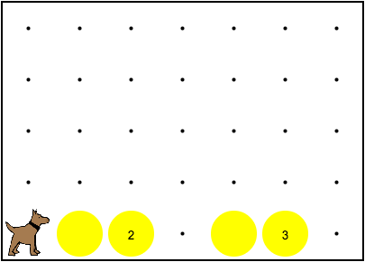
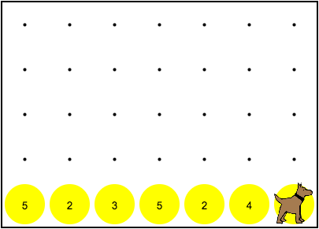

# Control Structures Example

Control structures allow us to shape the flow of our programs and write code that can adapt to the conditions of the world. Control structures can be combined to produce even more responsive and power programs.

## Control Structures

There are two main categories of control structures that we have learned so far. The first group, if statements and if-else statements, ask questions about the world. The second group, for loops and while loops, repeat patterns of code.

| Ask Questions | Repeat Code   |
| ------------- | ------------- |
| If Statement  | For Loop  |
| If/Else Statement  | While Loop  |

In the world above, Karel needs to put down five tennis balls in every empty spot. If a spot is not empty, Karel should only put down one more tennis ball.

We will need to use several different control structures to solve this problem. First, we need Karel to determine whether there is a ball present or not. If there is not a ball, Karel should put down five tennis balls. Otherwise (if there is already a ball), Karel should just put down one ball. This can be easily written using an if-else statement.

Counting out five tennis balls suggests the use of a loop. In this case, a for loop works well.

Finally, this process needs to occur across the entire world. A while loop can be used to repeat the code as long as the front is clear.

A typical solution for this challenge may look like:

    function start(){
        while(frontIsClear()){
            checkAndPutBalls();
            move();
        }
        checkAndPutBalls();
    }

    function checkAndPutBalls(){
        if(noBallsPresent()){
            for(var i = 0; i < 5; i++){
                putBall();
            }
        } else {
            putBall();
        }
    }

