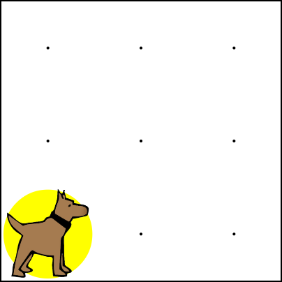
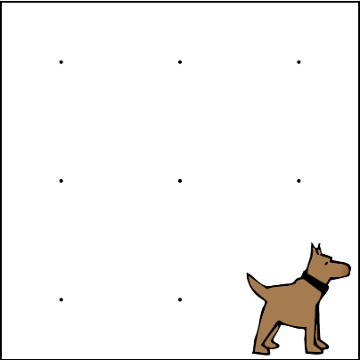

# If Statements and Conditionals

Now that Karel can understand and learn new commands, it is time to write programs that have Karel adapt to different situations. Like functions, these new additions to Karel's language will allow us to write code that can be used in many different situations.

## Asking Questions about Karel's World

Karel's world tends to change a lot. Sometimes it is large, other times it is small. It often has walls, but not always. And though there are usually tennis balls scattered throughout the world, the balls are rarely in the same place for each exercise.

Given these changing conditions, there are many questions that would be useful for Karel to ask. For example:
 - Is there a ball where Karel is standing?
 - Is Karel facing north?
 - Is Karel hungry?

## Introducing Conditions

These types of questions can be asked using **conditions**. Conditions are very simple functions that look at the state of Karel's world and return a true or false answer. Here is a list of the conditions that Karel can check:

|  |  |
| -------------- | ---------------- |
| frontIsClear() | frontIsBlocked() |
| leftIsClear()  | leftIsBlocked()  | 
| rightIsClear() | rightIsBlocked() | 
| facingNorth()  | notFacingNorth() |
| facingSouth()  | notFacingSouth() |
| facingEast()   | notFacingEast()  |
| facingWest()   | notFacingWest()  |
| ballsPresent() | noBallsPresent() |

Like Karel's other commands, it is important to include the parentheses `()` at the end.

In the following world, the `frontIsClear()` condition returns true, as Karel's front is clear. The `ballsPresent()` condition also returns true, because Karel is standing on a ball. Similarly, the `facingSouth()` condition would return false, as Karel is not facing south.

## Introducing If Statements

Checking conditions allows us to write programs that can respond to changes in Karel's world. One important way to handle different conditions is by using **if statements**. If statements let us check a condition before executing any code. 
We can use if statements to help control the flow of the program. The basic format of an if statement is:

    if(condition){
        // code to run
    }

An if statement will only execute if the condition is true. Such checks probably sound familiar -- in fact, we use the same type of thinking in everyday life. Here are some examples of real-world if statements:

- if there is music, then I will dance
- if I am tired, then I will sleep
- if it is raining, then I will carry an umbrella

Pay attention to the structure of these statements. The first part is used to check the condition of the world (am I tired? is it raining?). The second part contains the "code" that will execute if the check is true. Thus, if it is raining, I will take my umbrella. On the other hand, if it is not raining, then I will not carry an umbrella.

Karel uses if statements and conditions in a similar way. For example, in the world above, Karel can check if the front is clear before moving:

    if(frontIsClear()){
        move();
    }
    
Using an if statement to check the world before moving helps Karel avoid crashing into the wall. Such a check would be important in a world like this one:

