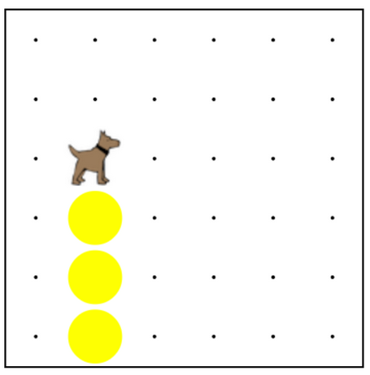

# Karel Can't Turn Right
In all of our programs so far, Karel has only been able to understand four commands.  Karel does everything only using these four commands.  However, sometimes it would be much easier to communicate with Karel if we could teach Karel more commands.  In this section, we are going to learn how to teach Karel some new tricks.


## Revisiting "Build a Tower"
Recall in the last section how we made Karel make a tower of tennis balls.  We told Karel
to `move()` and `turnLeft()` and `putBall()` until we had a tower.  At the end of the program, Karel was still at the top of the tower, like as in the picture below.  




Suppose that now we want Karel to come back down from the top of the tower.  The first thing we need to do is get Karel facing in the right direction.  One way to do this is to tell Karel

```
turnLeft();
turnLeft();
turnLeft();
```
And then tell Karel to 
```
move();
move();
move();
```
back to the bottom of the tower.  

However, telling Karel to `turnLeft()` three times is not very readable.  That's a lot of writing when all we really want is to tell Karel to "turn right."


## Don't You Wish You Could Say `turnRight();`

## Introducing Functions
How do we go about teaching Karel new tricks?   We can teach Karel new commands using functions.   We've seen that Karel already knows four commands, or functions.  Now we want to teach Karel a new command, `turnRight()`.  We can teach Karel to turn right by defining a function called `turnRight()` that shows Karel how to turn to the right.

 
## Writing `turnRight()`
The very first thing we need to do is declare the function `turnRight()`.  So on a blank line in our program, we write

```function turnRight() { } ```

Now Karel knows that `turnRight()` is a command, but we haven't yet taught Karel what the command means. To teach Karel what the command means, we have to fill in the commands in between the curly braces.

Let's think for a minute about our new command.  When we tell Karel `turnRight()`, we want Karel to turn to face in a new direction, specifically the direction that is to Karel's current right.  How do we tell Karel to turn to the right? We did this when we told Karel to come back down from the tower using `turnLeft()`.  We need to put these commands inside of the function so Karel knows what to do when we command `turnRight()`.  Our finished function looks like this:

```
function turnRight() {
    turnLeft();
    turnLeft();
    turnLeft();
}
```
There are three very important things to note about our new command.  First, we have the keyword function at the beginning of the line.  Second, we have a set of parenthesis at the end of the function name.  Third, we have a set of commands inside of curly braces.  This set of commands is called the function body.  It is very important to remember that everything Karel is supposed to do when told the command is INSIDE of the curly braces.

Congratulations!  You taught Karel how to turn right!


