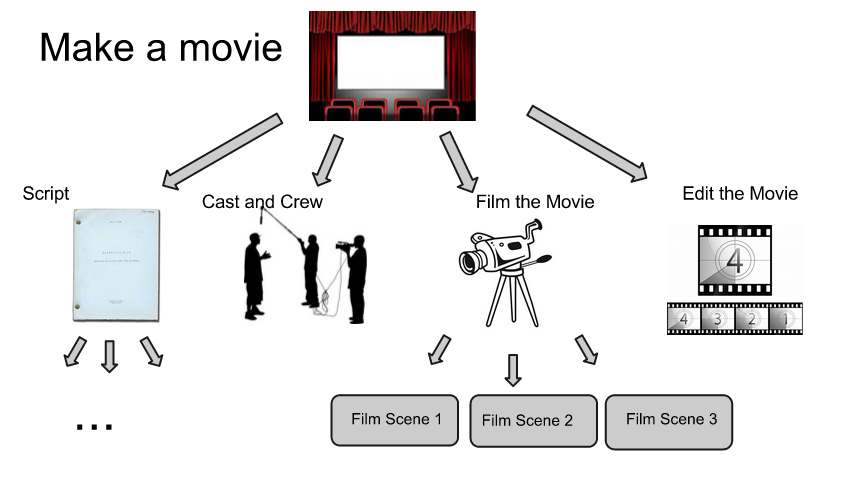

# Top Down Design and Decomposition in Karel

Now that we have most of the tools we need, let's focus on the structure of our program.  Recall that we have commands and functions as the building blocks of our program.  Commands go inside functions, and functions make up our program.  So how do we effectively build programs using functions?

## When Do We Use a Function?
When we defined functions, we said that functions are used to break down the problem into little bits and make our program more readable.  Tucking away lists of commands inside of a named function makes the program much easier to read.  Note that while all code must be in some function, some of the commands may be perfectly acceptable to put in the start function.

Here are some guidelines for when to put a group of commands into their own function.

1. The group of commands accomplishes a specific task
2. The specific task is used more than once
3. The specific task solves a smaller problem, but helps solve the bigger problem.  If this is the case, it is ok if the function is only used once.

This leads us to the next discussion - what does it mean to have a specific task or a smaller problem?

## Top-down Design and Decomposition
Each program has the goal of solving a problem.  Most of the time, this problem is rather large and complex, or at least can be broken down into several parts.

When you write your program, you first want to consider the big picture - what is your overall goal?  Then you want to break down the problem into smaller chunks.  What is the first step?  The second step?  Once you have your steps, can you break down the steps even further?  Keep breaking down each subproblem until you have defined definite tasks that need to be accomplished.  These tasks don't need to be so small they are accomplished in a single command, but they should be small enough that you could describe them in a short, single sentence.

## Making a Movie
As an analogy, think about making a movie.  The biggest problem that needs to be solved is that we want a feature length movie that will have the biggest names in Hollywood with awesome special effects and will entertain everyone who sees it.  You can see that this is a very large problem.  So let's break it down, as shown in the picture below.



The big problem is shown at the top.  Then it is broken down into 4 subproblems.  We need to entertain everyone, so we need a good script.  We want the biggest names in Hollywood, so we need to solve the cast and crew problem.  Then we want awesome sound effects, so we need to edit the movie.  We actually need to have footage, so we need to film the movie.

Then you can see that each one of these problems needs to be broken down into more managable problems.  Here, we only show that Film the Movie gets broken down into filming each scene.

You can see how each little problem is combined with the solutions to the other little problems to make up the solution to the overall problem.

## Hurdle Karel
Now, say we have a problem where we want Karel to go down the street and jump over all of the hurdles.  The beginning world would look like this:


And the ending world looks like this:


Let's think about how to solve this. What is the big goal?  We want Karel to go down the street, jump over every hurdle, and stop at the end.

What are the next smaller goals?
1. Karel needs to go down the street until the end
2. When Karel meets a hurdle, Karel needs to jump over it
3. After the last hurdle, Karel needs to go to the end of the street


What tasks should be accomplished in functions?
1. Karel should go to the next hurdle
2. Karel should jump over the hurdle
3. Karel should stop at the wall at the end of the street

See how each function is reusable?  We will need to use the first function 3 times and the second function 2 times.

Finally, we can outline the code we need to write.

```
function start(){
    runToHurdle();
    jumpHurdle();
	runToHurdle();
	jumpHurdle();
	runToFinish();
}

function jumpHurdle(){
  // Make Karel jump over a hurdle

}

function runToHurdle(){
  // make Karel go to the next hurdle
}

function runToFinish(){
    // make Karel go to the end of the street
}
```

For the sake of space, not all of the functions have been fully implemented.  However, notice how the use of functions makes the program's goal obvious.  You can read through the start function like it is telling a story.  Each function accomplishes a specific, small part of the problem.


##Summary
Let's do a brief recap of all of the information we've learned.  Programs are made up of functions, which are made up of commands.  We need to build our program using functions to make our code readable and to break down the problem.  The program's problem, or goal, should be broken down into single sentence goals.  Each of these small goals gets its own function.


